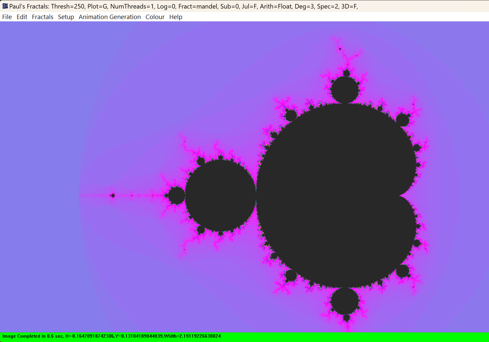
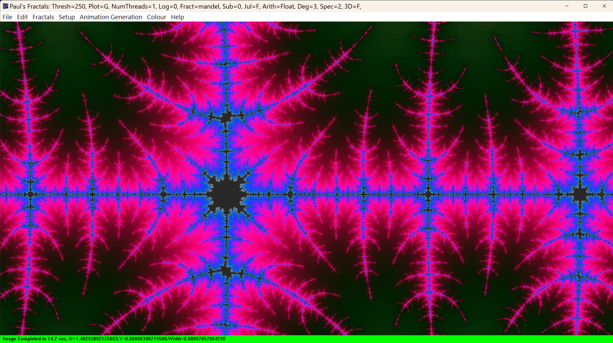
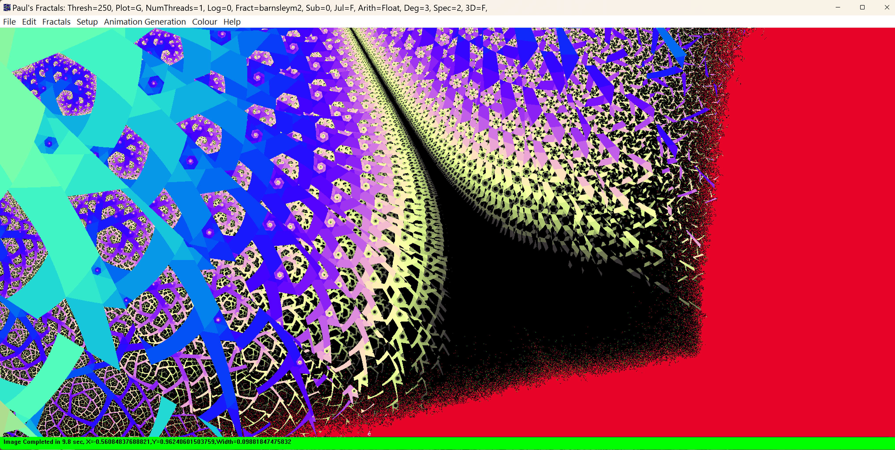
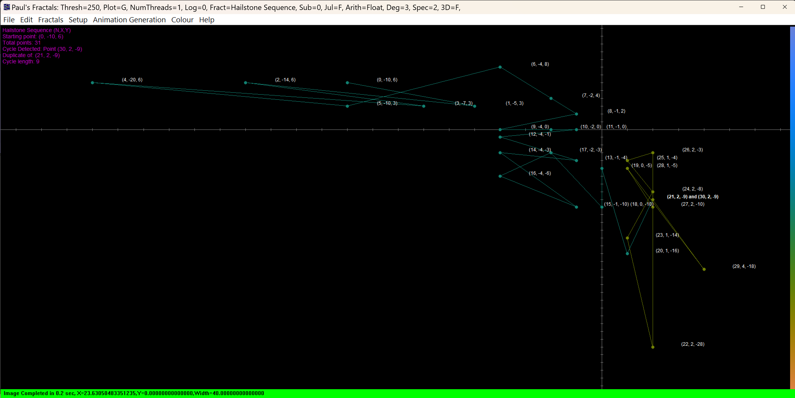

# ManpWIN - Advanced Fractal Explorer for Students


**Educational C++ Fractal Explorer - 240+ Types, Deep-Zoom Technology, Clone & Build with Zero Configuration**

A comprehensive fractal rendering and 2-D Hailstone visualization app, featuring cutting-edge deep-zoom algorithms, including perturbation theory, BLA acceleration, and arbitrary-precision arithmetic. This is a self-contained educational fork with all dependencies included - builds immediately in Visual Studio with zero setup.

---

## 📸 Screenshots


*Classic Mandelbrot set with smooth purple-blue coloring - the iconic fractal that started it all*


*Deep zoom exploration using perturbation theory and BLA acceleration - revealing self-similar structures at extreme magnifications*


*Barnsley M2 IFS fractal - one of 240+ fractal types available, demonstrating the variety beyond Mandelbrot sets*


*2D Hailstone sequence visualization with cycle detection - exploring discrete dynamical systems on the integer lattice*

---

## 💻 Quick Start

### 📦 Download ManpWIN (Latest Release)

[](https://github.com/markhassellsmith/manpwin/releases/latest)

Always get the newest version here:

👉 **[Download Latest Release](https://github.com/markhassellsmith/manpwin/releases/latest)**

This ensures users always get the most up‑to‑date build.

- ✅ No installation required
- ✅ No Visual Studio needed  
- ✅ Just extract and double-click!
- ✅ Includes quick start guide

**System Requirements:** Windows 10 or 11 (64-bit)

---

### 👨‍💻 Developers: Build from Source

Want to study the code or contribute?

```bash
git clone https://github.com/markhassellsmith/manpwin.git
cd manpwin
# Open ManpWIN64.sln in Visual Studio 2022, press F5
```

**That's it!** All dependencies included - builds immediately with zero configuration.

---

## 🎓 Designed for Math and Science Students

This fork is specifically configured for **immediate use in educational settings**—perfect for undergraduate and graduate students in mathematics, physics, computer science, and computational sciences.

**Why This Project is Perfect for Students:**

- ✅ **Self-Contained** - All libraries included, no dependency hunting
- ✅ **Clone → Build → Run** - Works immediately, no configuration needed
- ✅ **240+ Fractal Algorithms** - From classic Mandelbrot to cutting-edge research
- ✅ **Deep Mathematical Concepts** - Perturbation theory, complex dynamics, numerical methods
- ✅ **Advanced C++ Techniques** - Templates, multithreading, arbitrary-precision arithmetic
- ✅ **Real-World Optimization** - BLA acceleration, SIMD-like techniques, memory management
- ✅ **Visual Feedback** - See the math come alive with beautiful visualizations
- ✅ **Extensible Architecture** - Add your own fractal formulas and algorithms

This repository contains a modernized CMake build system enabling reproducible Debug and Release builds with Visual Studio 2022.

---

## 🧮 What Makes This Project Mathematically Interesting?

### For Mathematics Students

**Complex Dynamics & Iteration Theory:**
- **240+ fractal types** including Mandelbrot, Julia sets, Newton fractals, and exotic variants
- **Perturbation theory implementation** - See how small changes affect chaotic systems
- **Deep zoom exploration** - Explore self-similarity at magnifications of 10^100+
- **Bifurcation diagrams** - Visualize period-doubling routes to chaos
- **Lyapunov fractals** - Study stability in dynamical systems

**Numerical Analysis & High-Precision Computing:**
- **MPFR library integration** - Arbitrary-precision arithmetic (100+ decimal places)
- **Quad-double (QD) library** - ~64 decimal digits precision
- **Double-double (DD) arithmetic** - ~32 decimal digits precision
- **FloatExp implementation** - Extended range floating-point for extreme magnifications
- **Numerical stability techniques** - See how precision affects iteration behavior

**Advanced Algorithms:**
- **BLA (Bilinear Approximation)** - Skip thousands of iterations using series approximation
- **Perturbation algorithm** - Calculate billions of pixels from one high-precision reference orbit
- **Series approximation** - Polynomial evaluation for fast convergence zones
- **Newton-Raphson root finding** - For Newton and Halley fractals
- **Derivative calculations** - Analytical derivatives for distance estimation

### For Physics & Applied Science Students

**Computational Physics Techniques:**
- **Slope shading/derivative methods** - Create 3D-like illumination from 2D data
- **Distance estimation** - Calculate distance to fractal boundaries
- **Potential field rendering** - Visualize "electrostatic" fields around fractals
- **Orbit traps** - Analyze trajectories in phase space

**Chaos Theory & Nonlinear Dynamics:**
- **Strange attractors** - Lorenz, Rössler, Hénon, and more (25+ types)
- **Fractal maps** - Iterate simple functions to produce complex behavior
- **Cellular automata** - Discrete dynamical systems
- **L-Systems** - Grammar-based fractal generation

**Visualization & Computer Graphics:**
- **Multithreaded rendering** - Parallel computing for performance
- **Bump mapping** - Surface normal estimation for realistic shading
- **Smooth coloring algorithms** - Continuous color gradients using escape-time smoothing
- **True-color rendering** - 24-bit RGB color space with custom palettes

### For Electrical Engineering Students

**Nonlinear Circuits & Chaotic Systems:**
- **Chua's Circuit Attractor** - Visualize the chaotic oscillator built in lab (the circuit is implemented!)
- **Bifurcation Diagrams** - See period-doubling routes to chaos in electronic circuits
- **Strange Attractors** - Model chaotic behavior in nonlinear circuits
- **Parameter Space Exploration** - Understand stability regions and chaos boundaries

**RF & Antenna Design:**
- **Fractal Antenna Patterns** - Design principles for compact, multiband antennas (industry standard for mobile devices)
- **Self-Similar Structures** - Understand fractal geometry applications in wireless systems
- **Frequency Response Analysis** - Visualize multiband characteristics through fractal iteration

**Signal Processing & Communications:**
- **Fractal Noise Models** - 1/f spectra and pink noise analysis
- **Chaos-Based Encryption** - Visualize chaotic sequences for secure communications
- **Spread Spectrum Systems** - Understand chaos applications in modern communications
- **Signal Compression** - Fractal-based compression algorithm visualization

**Relevant Courses:**
- Nonlinear Circuits & Systems
- Antenna Theory & RF Design
- Digital Signal Processing
- Communications Theory
- Chaos Theory & Applications in EE

### For Mechanical Engineering Students

**Fluid Dynamics & Turbulence:**
- **Turbulent Flow Visualization** - Strange attractors model chaotic fluid behavior
- **Lorenz Attractor** - Simplified convection model (Rayleigh-Bénard instability)
- **Hénon Map** - Discrete approximation of continuous dynamical systems
- **Self-Similarity in Turbulent Cascades** - Energy transfer across scales

**Vibrations & Nonlinear Dynamics:**
- **Chaotic Oscillators** - Forced pendulums, Duffing oscillator behavior
- **Bifurcation Analysis** - Parameter-dependent stability changes
- **Rotor Dynamics** - Chaotic motion in rotating machinery
- **Nonlinear Resonance** - Complex vibration patterns in mechanical systems

**Materials Science & Fracture Mechanics:**
- **Fractal Crack Patterns** - Self-similar fracture propagation models
- **Surface Roughness** - Fractal dimension characterization
- **Material Failure Analysis** - Predict crack growth using fractal geometry
- **Tribology** - Friction and wear patterns exhibit fractal behavior

**Heat Transfer & Manufacturing:**
- **Fractal Heat Sinks** - Optimize surface area for thermal management
- **Surface Engineering** - Roughness optimization for heat transfer
- **Manufacturing Defects** - Fractal analysis of machined surfaces

**Relevant Courses:**
- Fluid Mechanics & Turbulence
- Vibrations & Dynamics
- Nonlinear Mechanics
- Fracture Mechanics & Materials Science
- Computational Fluid Dynamics (CFD)
- Heat Transfer

### For Computer Science Students

**Software Engineering:**
- **156 C++ source files** - Real-world large-scale C++ project
- **Modular architecture** - 6 separate CMake subprojects
- **Template metaprogramming** - Generic numeric types (Complex, BigComplex, etc.)
- **Object-oriented design** - Class hierarchies for fractals, colors, arithmetic

**Performance Optimization:**
- **Multithreading** - Thread pool for rendering, parallel formula parser
- **Cache optimization** - Reference orbit reuse, BLA table lookup
- **Memory management** - Smart pointers, vector optimization
- **SIMD-ready code structure** - Organized for vectorization

**Algorithms & Data Structures:**
- **Parser/compiler** - Custom formula language with VM execution
- **Color palette engines** - Multiple interpolation algorithms
- **Spatial data structures** - Efficient pixel-to-coordinate mapping
- **Approximation tables** - Dynamic programming for BLA

---

## 📚 Implemented Fractal Categories (240+ Types)

### Classic Fractals (20+)
- **Mandelbrot Set** - Standard, power variants (z^3, z^4, etc.), sine/cosine variations
- **Julia Sets** - Parameter space exploration, animated Julia morphing
- **Burning Ship** - Absolute value variations, power modifications
- **Newton Fractals** - Root-finding visualizations with various polynomials
- **Magnet Fractals** - Types 1 & 2, based on physical systems

### Advanced Mandelbrot Variants (40+)
- **MandelDerivatives** - Kalles Fraktaler-style deep zoom fractals
- **Mandelbar (Tricorn)** - Conjugate variant
- **Spider** - Additive feedback parameter
- **Thorn** - Period-based variations
- **Tetration** - Tower of powers iteration
- **Power Towers** - Generalized exponentiation
- **Perpendicular/Buffalo/Celtic** - Modified absolute value patterns

### Scientific & Chaotic Systems (30+)
- **Strange Attractors:**
  - Lorenz attractor (3 variants)
  - Rössler system
  - Hénon map
  - Pickover attractor
  - Gingerbread map
  - Ikeda map
  - Chua's circuit

- **Bifurcation Diagrams:**
  - Logistic map
  - May's equation
  - Lambda variations
  - Stewart variations

- **Lyapunov Fractals** - Stability analysis visualization

- **Hailstone Sequences** - 2D integer lattice dynamical systems
  - **5 Transformation Presets:**
    - Current 2D Hailstone (parity-based rules on Z × Z)
    - Simple Collatz (classic conjecture on both dimensions)
    - Symmetric Variant (balanced growth/shrinkage)
    - Coordinate Swap (diagonal coupling behavior)
    - Bounded Growth (controlled 2x expansion)
  - **Features:**
    - Cycle detection with visual highlighting
    - Full Z × Z domain support (negative integers)
    - Interactive toggles (axes, labels, dots)
    - Real-time visualization of sequence paths
    - Statistical overlay showing cycle information
  - **Educational Value:**
    - Discrete dynamical systems on integer lattice
    - Parity-based transformation rules
    - Cycle detection algorithms
    - Divergence vs. convergence behavior
    - Pigeonhole principle demonstration

### Geometric & IFS Fractals (20+)
- **IFS (Iterated Function Systems)** - 2D and 3D
- **Sierpinski** - Triangle, carpet, and variations
- **Apollonius** - Circle packing fractals
- **Pascal Triangle** - Modular arithmetic patterns
- **L-Systems** - Grammar-based plant-like structures
- **Barnsley Fern** - Multiple M and J variants
- **Curves** - Space-filling curves

### Orbit Trap & Artistic Fractals (25+)
- **BuddhaBrot** - Probability density of orbits
- **Popcorn** - Discontinuous iteration
- **Hopalong** - Martin's hopalong attractor
- **Plasma** - Midpoint displacement fractals
- **Diffusion-Limited Aggregation**
- **Ant** - Langton's ant cellular automaton
- **Escher** - Tessellation-based patterns

### Tierazon Fractals (30+)
Complete Tierazon formula set including:
- **Phoenix** - Phoenix Julia and Mandelbrot
- **Hypercomplex** - 4D iterations projected to 2D
- **Mandelbar** - Conjugate variants
- **Froth** - Bubble-like patterns
- **Icon/Icon3D** - Crystalline structures
- **Multiple function compositions** - fn+fn*pixel variations

### Mathematical Curiosities (20+)
- **Fourier** - Frequency domain fractals
- **Oscillators** - Harmonic motion-based
- **Redshift Rider** - Phase-shifted iterations
- **Knots** - Mathematical knot visualization
- **Surfaces** - 3D surface projections
- **Geometry** - Circle, cross, triangle patterns
- **Fibonacci** - Golden ratio-based
- **Zigzag** - Piecewise linear systems

### Advanced Research Fractals (15+)
- **Perturbation-optimized** - High-performance deep zoom
- **Polynomial** - Arbitrary degree polynomials
- **Rational Maps** - P(z)/Q(z) iterations
- **Newton Variations** - Apple, Flower, Cross, Nova
- **Malthus** - Population dynamics
- **Kleinian Groups** - Hyperbolic geometry

### Custom & Formula-Based
- **Formula Parser** - Define custom fractals with scripting language
- **Screen Formula** - Real-time formula interpretation
- **User-defined functions** - Extend with new mathematical operations

---

## 🚀 Key Technical Features

### Deep Zoom Technology
- **Perturbation Theory** - Calculate reference orbit once, perturb for billions of pixels
- **BLA (Bilinear Approximation)** - Skip thousands of iterations using series expansion
- **Arbitrary Precision** - MPFR up to thousands of decimal places
- **FloatExp** - Extended exponent range for extreme magnifications (10^10^100)
- **Automatic precision scaling** - Switches precision levels as needed

### Rendering Modes
1. **Standard Escape-Time** - Classic iteration counting
2. **Slope/Derivative Shading** - 3D-like illumination using derivatives
3. **Forward Difference** - Numerical derivative approximation
4. **Distance Estimation** - Boundary proximity calculation
5. **Potential Field** - Electrostatic-like visualization
6. **Orbit Traps** - Color based on orbit proximity to shapes
7. **Biomorph** - Biological-looking color modes

### Color & Visualization
- **True Color (24-bit RGB)** - Millions of colors
- **Smooth Coloring** - Continuous gradients using log smoothing
- **Palette System** - Load Fractint (.map) palettes
- **Bump Mapping** - Simulated 3D lighting
- **Color Cycling** - Animated color rotation
- **Inside/Outside Coloring** - Separate schemes for set membership

### Performance Features
- **Multithreaded Engine** - Automatic thread pool (uses all CPU cores)
- **Solid Guessing** - Skip interior regions intelligently
- **Boundary Tracing** - Efficient outline calculation
- **Progressive Rendering** - See results while computing
- **Worklist Management** - Dynamic task distribution
- **Memory-Mapped Files** - Handle huge datasets

### Formula Parser & Extensibility
- **Custom Formula Language** - Define fractals with scripts
- **Virtual Machine Execution** - Compiled bytecode for speed
- **100+ Built-in Functions** - Trig, hyperbolic, special functions
- **Variable Management** - Complex scripting support
- **Fractint Compatibility** - Import classic formulas

---

## 📋 Technology Stack

**Core Technologies:**
- **Language**: C++ (C++17 standard)
- **Platform**: Windows 10/11 (x64)
- **Build System**: CMake 3.23+
- **IDE**: Visual Studio 2022 (Community Edition works perfectly)
- **UI Framework**: Win32 API (native Windows GUI)

**Mathematical Libraries:**
- **MPFR 4.2.2** - Multiple precision floating-point (arbitrary precision)
- **GMP 6.3.0** - GNU Multiple Precision Arithmetic Library
- **QD Library** - Quad-double precision (~64 decimal digits)
- **DD Arithmetic** - Double-double precision (~32 decimal digits)

**Supporting Libraries:**
- **libpng** - PNG image format export
- **ZLib** - Compression library
- **MPEG** - Video/animation export

**Architecture:**
- **156 C++ source files** in main application
- **21 parser files** - Separate formula parsing engine
- **6 CMake subprojects** - Modular build structure
- **Vendored dependencies** - All libraries included

---

## ✨ Student-Friendly Features

**Learning Opportunities:**

1. **Mathematics:**
   - Explore complex number arithmetic visually
   - See chaos theory and sensitive dependence on initial conditions
   - Experiment with numerical stability and precision
   - Study self-similarity and fractal dimension
   - Investigate period-doubling and bifurcations

2. **Computer Science:**
   - Large-scale C++ project structure
   - Design patterns (Factory, Strategy, Observer)
   - Multithreading and synchronization
   - Performance profiling and optimization
   - Parser/compiler construction
   - Memory management techniques

3. **Computational Science:**
   - Numerical methods implementation
   - Precision vs. performance tradeoffs
   - Algorithm complexity analysis
   - Parallel computing strategies
   - Visualization techniques

4. **Physics:**
   - Dynamical systems visualization
   - Phase space exploration
   - Attractor behavior
   - Chaos and determinism

**Project Ideas for Students:**

The following projects are organized by difficulty and discipline. Choose based on your skill level and interests!

### 🌱 Beginner Projects (1-2 weeks, First Contributions)

**Getting Started:**
1. **Add a New Color Palette**
   - Create custom color schemes in `Colour.cpp`
   - Learn about color interpolation algorithms
   - Easy to visualize and validate results

2. **Implement Parameter Presets**
   - Store favorite fractal configurations
   - Save/load parameter sets to files
   - Practice file I/O and data structures

3. **Add Fractal Information Display**
   - Show current zoom level, iteration count, precision
   - Create status bar or overlay
   - Learn about UI integration

4. **Create Keyboard Shortcuts**
   - Add hotkeys for common operations
   - Implement zoom, pan, reset controls
   - Practice event handling

5. **Implement Simple Fractal Variants**
   - Burning Ship with different exponents
   - Modified Julia sets with new parameters
   - Start in `Pixel.cpp` with existing templates

### 🌿 Intermediate Projects (4-8 weeks, Course Projects)

**For Computer Science Students:**

6. **Implement Histogram-Based Coloring**
   - Analyze iteration distribution
   - Equalize color mapping for better contrast
   - Learn statistical algorithms and optimization

7. **Add Progressive Rendering Preview**
   - Render at multiple resolutions
   - Display low-res preview while computing high-res
   - Practice asynchronous programming

8. **Create Parameter Animation System**
   - Interpolate between fractal states
   - Generate smooth transitions (Julia morphing, zoom sequences)
   - Build keyframe system similar to video editing

9. **Implement Undo/Redo System**
   - Track navigation history
   - Enable stepping backward through zooms
   - Learn Command pattern and state management

10. **Build Fractal Comparison Viewer**
    - Side-by-side rendering of different fractals
    - Synchronized zoom/pan
    - Practice parallel rendering and UI layout

**For Mathematics Students:**

11. **Implement New Escape-Time Fractals**
    - Research and code: Mandelbox, Quaternion Julia sets
    - Understand convergence criteria
    - Experiment with mathematical variations

12. **Add Distance Estimation Rendering**
    - Calculate distance to fractal boundary
    - Create sharp, high-quality boundaries
    - Learn derivative-based techniques

13. **Implement Orbit Trap Variations**
    - Point, line, circle, and custom shape traps
    - Explore different coloring based on orbit proximity
    - Study phase space and trajectories

14. **Create Statistical Analysis Tools**
    - Analyze iteration distributions
    - Compute fractal dimension estimates
    - Graph convergence rates and patterns

15. **Add Series Approximation for More Fractals**
    - Extend BLA to support additional fractal types
    - Research polynomial approximations
    - Optimize deep zoom for new fractals

**For Physics/Visualization Students:**

16. **Implement 3D Lighting and Shadows**
    - Advanced slope shading with multiple light sources
    - Cast shadows based on fractal topology
    - Create realistic depth perception

17. **Add Real-Time Preview Mode**
    - Low-iteration interactive exploration
    - Dynamic parameter adjustment
    - Optimize for responsiveness over quality

18. **Create Fractal Animation Export**
    - Generate video sequences (zoom, rotation, parameter changes)
    - Integrate with FFMPEG or similar
    - Learn video encoding and frame management

19. **Implement Edge Detection and Enhancement**
    - Detect and highlight fractal boundaries
    - Apply image processing filters
    - Combine mathematical and visual techniques

20. **Build Heat Map Visualization**
    - Show iteration density as temperature
    - Create "hot spots" for interesting regions
    - Guide exploration automatically

### 🌳 Advanced Projects (Semester/Capstone, 8-16 weeks)

**High-Performance Computing:**

21. **GPU Acceleration with CUDA/OpenCL**
    - Port rendering kernels to GPU
    - Achieve 10-100x speedup
    - Learn parallel computing architectures
    - **Difficulty:** High | **Impact:** Massive

22. **Distributed Rendering System**
    - Split work across multiple machines
    - Network-based fractal computation
    - Load balancing and fault tolerance
    - **Difficulty:** High | **Impact:** Research-grade

23. **SIMD Optimization**
    - Vectorize iteration loops (AVX2/AVX-512)
    - Process multiple pixels simultaneously
    - Learn low-level optimization
    - **Difficulty:** Medium-High | **Impact:** 2-4x speedup

24. **Adaptive Precision Management**
    - Automatically select precision level per region
    - Minimize computation while maintaining accuracy
    - Smart switching between double/DD/QD/MPFR
    - **Difficulty:** High | **Impact:** Major optimization

**Advanced Mathematics:**

25. **Implement Automatic Differentiation**
    - Calculate exact derivatives symbolically
    - Improve distance estimation accuracy
    - Learn computational differentiation techniques
    - **Difficulty:** High | **Impact:** Better rendering quality

26. **Add Polynomial Root Finding Visualizations**
    - Generalize Newton fractals to arbitrary polynomials
    - Visualize convergence basins
    - Support complex coefficients
    - **Difficulty:** Medium | **Impact:** Educational value

27. **Implement Fractal Dimension Calculator**
    - Box-counting algorithm
    - Estimate Hausdorff dimension
    - Validate against known fractals
    - **Difficulty:** Medium-High | **Impact:** Research tool

28. **Create Lyapunov Exponent Visualization**
    - Calculate stability measures
    - Color by convergence/divergence rates
    - Explore chaos theory visually
    - **Difficulty:** High | **Impact:** Educational/research

**Software Engineering:**

29. **Add Comprehensive Unit Testing**
    - Test precision conversions, arithmetic operations
    - Validate fractal calculations against references
    - Set up CI/CD pipeline
    - **Difficulty:** Medium | **Impact:** Code quality

30. **Build Plugin Architecture**
    - Allow loading external fractal formulas
    - Dynamic library system
    - API for third-party extensions
    - **Difficulty:** High | **Impact:** Extensibility

31. **Create Cross-Platform Port**
    - Linux/Mac support
    - Replace Win32 with cross-platform GUI (Qt, wxWidgets)
    - Maintain feature parity
    - **Difficulty:** High | **Impact:** Accessibility

32. **Implement Parameter Database and Search**
    - Store interesting zoom locations
    - Tag and categorize discoveries
    - Search by fractal type, zoom level, features
    - **Difficulty:** Medium | **Impact:** Usability

### 🚀 Research-Level Projects (Thesis/Publication Quality)

**Cutting-Edge Algorithms:**

33. **Novel Series Approximation Methods**
    - Research new approximation techniques
    - Extend beyond current BLA limitations
    - Potential publication in fractal journals
    - **Difficulty:** Very High | **Impact:** Research contribution

34. **Machine Learning for Zoom Location Prediction**
    - Train ML model to find interesting regions
    - Automatic discovery of aesthetic locations
    - Guide exploration intelligently
    - **Difficulty:** Very High | **Impact:** Novel application

35. **Implement Perturbation Theory for Complex Formulas**
    - Extend perturbation to non-polynomial fractals
    - Research mathematical foundations
    - Enable deep zoom for wider fractal families
    - **Difficulty:** Very High | **Impact:** Major advancement

36. **Real-Time Deep Zoom Exploration**
    - Interactive navigation at extreme magnifications
    - Predictive rendering and caching strategies
    - Sub-second response times at 10^100 zoom
    - **Difficulty:** Very High | **Impact:** Technical achievement

**Interdisciplinary Research:**

37. **Fractal-Based Procedural Generation**
    - Use fractals for terrain, textures, patterns
    - Game development integration
    - Real-time generation algorithms
    - **Difficulty:** High | **Impact:** Cross-domain application

38. **Quantum Algorithm Exploration**
    - Investigate quantum computing for fractal rendering
    - Theoretical or simulated implementation
    - Future-looking research
    - **Difficulty:** Very High | **Impact:** Cutting-edge

39. **Comparative Analysis of Numerical Methods**
    - Benchmark precision vs. performance tradeoffs
    - Study arbitrary-precision alternatives
    - Publish performance analysis paper
    - **Difficulty:** Medium-High | **Impact:** Academic publication

40. **Educational Interactive Tutorial System**
    - Built-in lessons about fractals and algorithms
    - Step-by-step visualization of computations
    - Pedagogical tool development
    - **Difficulty:** Medium-High | **Impact:** Educational outreach

---

### 📋 Project Selection Guide

**Choose by Time Available:**
- **1-2 weeks:** Projects 1-5 (Beginner)
- **1 month:** Projects 6-10 (Intermediate CS)
- **Semester:** Projects 21-32 (Advanced)
- **Thesis:** Projects 33-40 (Research)

**Choose by Interest:**
- **Love Math:** Projects 11-15, 25-28, 33-35
- **Performance Nerd:** Projects 21-24, 36
- **Visual Artist:** Projects 16-20, 30
- **Software Engineer:** Projects 29-32, 40
- **Researcher:** Projects 33-40

**Choose by Impact:**
- **Quick Win:** 1, 2, 3, 4, 5
- **Portfolio Piece:** 21, 22, 30, 31
- **Publication Potential:** 33, 35, 36, 39

---

### 💡 Tips for Success

1. **Start Small** - Even if your goal is GPU acceleration, start with a simple color palette
2. **Document Everything** - Write about your approach, challenges, solutions
3. **Use AI Assistance** - Ask Copilot/ChatGPT for help understanding the codebase
4. **Test Thoroughly** - Compare your results with existing implementations
5. **Share Your Work** - Post on FractalForums, GitHub discussions, or course forums
6. **Measure Performance** - Before and after metrics make compelling demonstrations
7. **Create Visualizations** - Screenshots, videos, and comparisons are powerful
8. **Write Tutorials** - Teaching others solidifies your understanding

---

## 🏗️ Build Requirements

**Minimal requirements - everything included!**

* **Windows 10 or 11** (x64)
* **Visual Studio 2022** - Free Community Edition works perfectly
  - Or Visual Studio 2019 (also supported)
  - Ensure "Desktop development with C++" workload is installed
* **Git** (for cloning the repository)

**That's literally it!** 

All mathematical libraries, PNG support, compression, everything is already in the repository. No hunting for downloads, no package managers to configure, no environment variables to set.

---

## ⚙️ Build Instructions

### Quick Start (30 seconds to running code!)

```bash
git clone https://github.com/markhassellsmith/manpwin.git
cd manpwin
```

Then either:
- **Double-click `ManpWIN64.sln`** and press F5, or
- **Right-click CMakeLists.txt** → Open with → Visual Studio 2022

**Done!** The application builds and runs.

---

### Detailed Instructions for First-Time Users

**Step 1: Install Visual Studio 2022**
- Download Visual Studio 2022 Community (free) from [Microsoft](https://visualstudio.microsoft.com/)
- During installation, select **"Desktop development with C++"**
- Wait for installation to complete (~15 minutes)

**Step 2: Clone the Repository**
- Option A: Use Git command line:
  ```bash
  git clone https://github.com/markhassellsmith/manpwin.git
  ```
- Option B: Download as ZIP from GitHub and extract

**Step 3: Open and Build**
- Navigate to the `manpwin` folder
- Double-click `ManpWIN64.sln`
- Visual Studio will open the project
- Press **F5** (or click the green "Start" button)
- First build takes 1-2 minutes
- Application window appears!

**Step 4: Explore**
- Try different fractal types from the menu
- Zoom in by clicking or selecting regions
- Adjust parameters to see different behaviors
- Export images as PNG files

---

### Command-Line Build (Advanced)

For students familiar with command-line tools:

```bash
git clone https://github.com/markhassellsmith/manpwin.git
cd manpwin
cmake -B build -G "Visual Studio 17 2022" -A x64
cmake --build build --config Release
build\Release\ManpWIN64.exe
```

For Debug builds (slower but with debugging symbols):
```bash
cmake --build build --config Debug
build\Debug\ManpWIN64.exe
```

---

### Troubleshooting First Build

**"Cannot find CMakeLists.txt"**
- Make sure you're in the `manpwin` directory
- The file should be at the root level

**"MSVC not found" or similar**
- Reinstall Visual Studio 2022
- Ensure "Desktop development with C++" workload is selected

**Build succeeds but app won't run**
- Try cleaning and rebuilding: Build → Clean Solution → Build Solution
- Check that you built for the same configuration you're running (Debug/Release)

**Linker errors about MPFR or GMP**
- These should not occur if you cloned the full repository
- Verify `external/lib/x64/` contains .lib files
- Re-clone the repository if files are missing

---

## 🤖 Learning with AI Assistance

**This project is ideal for AI-assisted learning with GitHub Copilot, ChatGPT, or similar tools!**

The combination of well-documented code + comprehensive fractals + AI assistance creates an excellent learning environment for students.

### How to Use AI to Learn from This Project

**Understanding Complex Concepts:**
- "Explain how perturbation theory works in `PertEngine.cpp`"
- "What is BLA acceleration and why does it make rendering faster?"
- "How does MPFR provide arbitrary precision arithmetic?"
- "Explain the mathematical basis of the Mandelbrot set iteration"
- "What is the difference between escape-time and potential field rendering?"

**Code Architecture Exploration:**
- "Show me the class hierarchy for different fractal types"
- "How are multiple precision types abstracted (Complex, BigComplex, etc.)?"
- "Explain the thread pool implementation for parallel rendering"
- "How does the formula parser compile and execute custom formulas?"
- "What design patterns are used in this codebase?"

**Algorithm Deep Dives:**
- "Walk me through the perturbation algorithm step by step"
- "How does BLA table lookup work?"
- "Explain the smooth coloring algorithm for continuous gradients"
- "How is the reference orbit calculated in deep zoom?"
- "What's the difference between derivative and forward-difference slope shading?"

**Mathematical Insights:**
- "Why do we need arbitrary precision for deep zooms?"
- "How does numerical instability affect iteration at high magnifications?"
- "Explain the series approximation used in BLA"
- "What is the mathematical relationship between Julia and Mandelbrot sets?"
- "How do strange attractors differ from escape-time fractals?"

**Extending the Code:**
- "Help me add a new Julia set variation"
- "How would I implement a Burning Ship power-3 variant?"
- "Show me how to add a new color palette algorithm"
- "Help me optimize this rendering loop"
- "How can I add GPU acceleration to this fractal type?"

**Debugging & Understanding:**
- "Why might this perturbation calculation lose precision?"
- "What could cause this rendering artifact at high zoom?"
- "Explain why this BLA lookup might fail"
- "How do I trace the iteration path for a specific pixel?"
- "What's causing this thread synchronization issue?"

### Suggested Learning Path with AI

**Week 1-2: Foundation**
1. Use AI to understand the basic Mandelbrot implementation
2. Trace through a simple fractal calculation (e.g., `Pixel.cpp`)
3. Learn about Complex number operations
4. Understand the escape-time algorithm

**Week 3-4: Precision & Performance**
1. Explore how MPFR and GMP provide arbitrary precision
2. Understand the FloatExp extended exponent implementation
3. Learn why precision matters for deep zooms
4. Study multithreading in the rendering engine

**Week 5-6: Advanced Algorithms**
1. Deep dive into perturbation theory (`Perturbation.cpp`, `PertEngine.cpp`)
2. Understand BLA acceleration (`Approximation.cpp`, `Approximation.h`)
3. Study reference orbit calculation and reuse
4. Learn series approximation techniques

**Week 7-8: Visualization & Extensions**
1. Explore slope shading and derivative methods (`Slope.cpp`)
2. Understand color algorithms and smooth coloring
3. Study the formula parser and VM (`parser/parser.cpp`)
4. Implement your own custom fractal or feature

**Project Ideas (AI-Assisted):**
- Add a new fractal type (ask AI to suggest interesting formulas)
- Implement histogram-based coloring
- Add real-time zoom preview
- Create parameter animation/morphing
- Optimize critical rendering loops with AI suggestions
- Add export to different formats (SVG, data files)
- Implement edge detection or anti-aliasing
- Create a fractal parameter database

---

## 📁 Project Structure

```
manpwin/
├── ManpWIN64/              # Main application (156 C++ files)
│   ├── Manpmain.cpp        # Application entry point
│   ├── Perturbation.cpp    # Perturbation algorithm implementation
│   ├── PertEngine.h        # Perturbation engine interface
│   ├── Approximation.cpp   # BLA acceleration
│   ├── Slope.cpp           # Derivative slope shading
│   ├── BigComplex.cpp      # Arbitrary-precision complex numbers
│   ├── Complex.cpp         # Standard double complex
│   ├── DDComplex.cpp       # Double-double precision
│   ├── QDComplex.cpp       # Quad-double precision
│   ├── ExpComplex.cpp      # FloatExp complex (extended exponent)
│   ├── Pixel.cpp           # Standard fractal iteration
│   ├── Colour.cpp          # Color algorithm implementations
│   ├── FractintFunctions.cpp   # Classic Fractint formulas
│   ├── TierazonFunctions.cpp   # Tierazon formula set
│   ├── BigMandelDerivatives.cpp # Deep zoom derivatives
│   ├── Fractype.h          # 240+ fractal type definitions
│   └── ...                 # Many more specialized files
│
├── parser/                 # Formula parser & VM (21 files)
│   ├── parser.cpp          # Parser implementation
│   ├── parser.h            # Parser interface
│   └── ...                 # Lexer, compiler, VM execution
│
├── qdlib/                  # Quad-double arithmetic library
│   ├── qd_real.cpp         # ~64 decimal digit precision
│   └── ...
│
├── pnglib/                 # PNG export implementation
│   └── ...                 # Vendored PNG library
│
├── ZLib/                   # Compression library
│   └── ...                 # Vendored zlib
│
├── MPEG/                   # Animation export
│   └── ...
│
├── external/               # High-precision math libraries
│   ├── include/
│   │   ├── mpfr.h          # MPFR arbitrary-precision
│   │   └── gmp.h           # GMP multi-precision integers
│   └── lib/x64/
│       ├── Debug/
│       │   ├── mpfr.lib
│       │   └── gmp.lib
│       └── Release/
│           ├── mpfr.lib
│           └── gmp.lib
│
├── HTMLHelp/               # Documentation files
│   └── html/               # User manual HTML files
│
├── CMakeLists.txt          # Root build configuration
├── ManpWIN64.sln           # Visual Studio solution
├── README.md               # This file
├── .gitignore              # Git ignore rules
└── ...

```

### Key Source File Categories

**Core Rendering:**
- `Pixel.cpp` - Standard double-precision iteration
- `BigPixel.cpp` - High-precision iteration
- `Perturbation.cpp` - Perturbation algorithm
- `PertEngine.cpp/h` - Engine orchestration

**Precision Types:**
- `Complex.cpp` - Double precision complex
- `BigComplex.cpp` - MPFR arbitrary precision
- `DDComplex.cpp` - Double-double (~32 digits)
- `QDComplex.cpp` - Quad-double (~64 digits)
- `ExpComplex.cpp` - FloatExp extended range

**Algorithms:**
- `Approximation.cpp` - BLA series approximation
- `Slope.cpp` - Derivative-based shading
- `FwdDiff.cpp` - Forward difference methods
- `MandelDerivatives.cpp` - Analytical derivatives

**Fractal Implementations:**
- `FractintFunctions.cpp` - 100+ classic fractals
- `TierazonFunctions.cpp` - Tierazon formula set
- `DDFractintFunctions.cpp` - DD precision variants
- `Miscfrac.cpp` - Miscellaneous fractals
- `Bif.cpp` - Bifurcation diagrams
- `BuddhaBrot.cpp` - Orbit density rendering

**Color & Visualization:**
- `Colour.cpp` - Color algorithms
- `Colour1.cpp` - Additional coloring
- `ColourMethod.cpp` - Inside/outside methods
- `TrueCol.cpp` - True color rendering

**Mathematical Support:**
- `BigDouble.cpp` - MPFR wrapper
- `BigTrig.cpp` - High-precision trig
- `BigMatrix.cpp` - Matrix operations
- `Arithmetic.cpp` - Abstracted math operations

---

## 🧠 Code Architecture Overview

### Abstraction Layers

```
┌─────────────────────────────────────────────┐
│  User Interface (Win32 API)                 │
│  - Window management, menus, dialogs        │
└────────────────┬────────────────────────────┘
                 │
┌────────────────▼────────────────────────────┐
│  Fractal Engine Dispatcher                  │
│  - Selects algorithm based on type/zoom     │
│  - Manages threads and work distribution    │
└────────────────┬────────────────────────────┘
                 │
      ┌──────────┼──────────┐
      │          │          │
┌─────▼─────┐ ┌─▼──────┐ ┌─▼──────────────┐
│ Standard  │ │  Big   │ │ Perturbation   │
│ (Double)  │ │ (MPFR) │ │ + BLA          │
└─────┬─────┘ └─┬──────┘ └─┬──────────────┘
      │         │          │
┌─────▼─────────▼──────────▼──────────────────┐
│  Precision-Abstracted Math                  │
│  - Complex, BigComplex, DDComplex, etc.     │
│  - Automatic operator overloading           │
└────────────────┬────────────────────────────┘
                 │
┌────────────────▼────────────────────────────┐
│  Base Libraries                             │
│  - MPFR, GMP, QD, PNG, Zlib                 │
└─────────────────────────────────────────────┘
```

### Thread Architecture

```
Main Thread
    ├── UI Event Loop
    └── Rendering Manager
            ├── Reference Orbit Calculator (1 thread, high precision)
            ├── BLA Table Builder (1 thread)
            └── Pixel Workers (N threads)
                    ├── Thread 1: rows 0, N, 2N, ...
                    ├── Thread 2: rows 1, N+1, 2N+1, ...
                    └── Thread N: ...
```

### Formula Parser Architecture

```
Formula Text → Lexer → Tokens → Parser → AST → Compiler → Bytecode → VM Executor
    │                                                                      │
    └──────────────────────────────────────────────────────────────────────┘
                        (Multithreaded execution)
```

---

## 🧯 Troubleshooting & FAQ

### Common Build Issues

**Q: Build fails with "cannot open file 'mpfr.lib'"**
- A: Ensure you cloned the full repository including `external/lib/` directory
- Verify files exist: `external/lib/x64/Debug/mpfr.lib` and `.../Release/mpfr.lib`
- Try: `git clone --recursive https://github.com/markhassellsmith/manpwin.git`

**Q: Linker error LNK2001 or LNK2019 about MPFR functions**
- A: Clean and rebuild: Build → Clean Solution → Build Solution
- Check CMake cache is current (delete `build/` folder if using command-line)

**Q: Application window appears blank/white**
- A: Resource files may not have compiled
- Solution: Clean and rebuild in Visual Studio
- Verify `ManpWIN64.rc` is in the project

**Q: Crashes immediately on startup**
- A: Likely Debug/Release mismatch
- Ensure you're running the same configuration you built
- Try Release build (more stable, faster)

**Q: "MSVCR###.dll not found" error**
- A: Install Visual C++ Redistributables from Microsoft
- Or rebuild with `/MT` instead of `/MD` (static runtime)

### Common Usage Questions

**Q: How do I zoom in?**
- A: Left-click to zoom in at that point, or drag a rectangle to zoom to that area
- Right-click to zoom out
- Use menu: View → Zoom for more options

**Q: Why is rendering so slow?**
- A: You're probably in Debug mode - use Release build for real work
- Deep zooms require high precision and are computationally expensive
- Enable perturbation + BLA for deep zooms (automatic in most cases)

**Q: How do I change fractal types?**
- A: Menu: Fractal → Select Type → Choose from 240+ options

**Q: How do I save an image?**
- A: File → Save Image → Choose PNG format

**Q: What zoom level needs arbitrary precision?**
- A: Around 10^14 magnification, double precision starts losing detail
- Perturbation algorithm automatically kicks in when needed
- MPFR precision scales automatically based on zoom depth

**Q: Can I animate parameters?**
- A: Yes! Use Animation menu to create parameter morphs and zoom sequences

### Performance Optimization Tips

1. **Use Release Build** - 10-100x faster than Debug
2. **Enable All CPU Cores** - Rendering automatically uses multithreading
3. **Enable BLA** - Huge speedup for deep zooms (usually automatic)
4. **Reduce Max Iterations** - Start with lower values (1000-10000) for exploration
5. **Use Perturbation** - Essential for deep zooms, enabled automatically
6. **Solid Guessing** - Enable to skip computing interior pixels

### Mathematical Questions

**Q: What's the deepest zoom possible?**
- A: Theoretically unlimited with MPFR
- Practically: 10^100+ magnification is achievable
- Beyond 10^300 requires very long computation times

**Q: Why do some areas render faster than others?**
- A: Interior points reach max iterations (slow)
- Exterior points escape quickly (fast)
- BLA can skip thousands of iterations in some regions

**Q: What is perturbation theory?**
- A: Instead of computing each pixel independently in high precision, calculate one reference orbit in high precision, then perturb it in low precision for billions of pixels
- Makes deep zooms practical (hours instead of months/years)

**Q: What is BLA?**
- A: Bilinear Approximation - uses series expansion to skip iterations
- Can jump ahead thousands of iterations in constant time
- Essential for modern deep-zoom rendering

**Q: Why doesn't BLA work for my fractal?**
- A: BLA currently only supports some fractal types (mainly Mandelbrot/Julia)
- Complex formulas may not have tractable series expansions
- Falls back to standard iteration for unsupported types

### Development Questions

**Q: How do I add a new fractal?**
- A: 
  1. Add definition to `Fractype.h`
  2. Implement formula in appropriate file (e.g., `Pixel.cpp`)
  3. Add menu entry in resource file
  4. Register in fractal table

**Q: Where is the main iteration loop?**
- A: Multiple places depending on fractal type:
  - `Pixel.cpp`: Standard fractals
  - `Perturbation.cpp`: Perturbation-based
  - `BigPixel.cpp`: High-precision only
  - Formula parser: `parser/parser.cpp`

**Q: How does multithreading work?**
- A: Work is divided by rows/regions
- Each thread gets independent pixel ranges
- Minimal synchronization (mostly independent)
- See `PertEngine.cpp` for orchestration

**Q: Can I use this for research?**
- A: Absolutely! That's one of its strengths
- Deep zoom capability rivals specialized tools
- Arbitrary precision enables numerical experiments
- Extensible for implementing new algorithms

---

## 🐉 Development History & Milestones

A chronological record of how this project evolved from legacy code to modern, student-ready software.

### Archaeological Phase 🏛️
- **Repository archaeology** — Excavated and removed duplicate/legacy source files
- **Code organization** — Identified active vs. deprecated components
- **Dependency mapping** — Documented all external library requirements

### Modernization Phase ⚙️
- **CMake resurrection** — Rebuilt from scratch with modular build architecture
- **Build system validation** — Tested Debug/Release configurations
- **Cross-version compatibility** — Ensured VS2019/VS2022 support

### Library Integration Wars ⚔️
- **pnglib integration** — Fixed missing target + linker language issues
- **MPFR linking battle** — Resolved runtime conflicts and imported library setup
- **GMP integration** — Configured multi-precision integer library
- **Static linking** — Eliminated DLL dependency issues
- **CRT conflict resolution** — Fixed `/NODEFAULTLIB:LIBCMTD` issues

### Engine Stabilization 🔧
- **Resource restoration** — Fixed blank screen by restoring `.rc` compilation
- **Parser evolution** — Stabilized multithreaded formula parser
- **Plotting expansion** — Added slope rendering + derivative plotting modes
- **Thread synchronization** — Fixed race conditions and mutex usage

### Bug Hunting Season 🐛
- **Debug infinite loop hunt** — Tracked worklist spin behavior
- **Palette parser fix** — Vector migration introduced subtle indexing bug
- **Solid guessing initialization** — Fixed uninitialized variable causing lock
- **Precision edge cases** — Resolved numerical instabilities
- **Memory leaks** — Plugged various resource leaks

### Performance & Features 🚀
- **BLA implementation** — Added Bilinear Approximation acceleration
- **Perturbation engine** — Integrated deep-zoom perturbation algorithm
- **FloatExp precision** — Extended exponent range for extreme magnifications
- **Reference orbit reuse** — Optimized deep zoom calculations
- **Multithreaded rendering** — Parallel computation across all cores

### Student-Ready Transformation 🎓
- **Self-contained fork** — Vendored all dependencies for clone-and-build simplicity
- **Documentation overhaul** — Comprehensive README for students
- **Build simplification** — One-click build from Visual Studio
- **First stable CMake build** — Debug + Release verified
- **Fresh clone validation** — Tested from clean repository state

### Current Status ✅
- **156 C++ source files** in main application
- **21 parser files** for formula engine
- **240+ fractal types** implemented
- **6 precision levels** (double, DD, QD, MPFR, FloatExp, BigDouble)
- **Multithreaded** rendering and parsing
- **BLA acceleration** for deep zooms
- **Perturbation theory** implementation
- **Slope shading** with derivatives
- **PNG export** and palette support

---

## 🤝 Contributing & Collaboration

This is a self-contained fork optimized for educational use. Contributions are welcome from students, educators, and researchers!

### Contribution Guidelines

**Code Contributions:**
- Never commit `build/`, `bin/`, `obj/`, or build artifacts
- Test both Debug and Release configurations before submitting
- Keep all dependencies in `external/` directory
- Document significant changes in commit messages
- Maintain backward compatibility when possible
- Follow existing code style and conventions

**Documentation:**
- Improve comments for complex algorithms
- Add examples for new features
- Update README for new fractals or capabilities
- Create tutorials for advanced topics

**Bug Reports:**
- Describe steps to reproduce
- Include Visual Studio version
- Specify Debug or Release build
- Attach relevant error messages or screenshots

**Feature Requests:**
- Describe the mathematical basis
- Explain use case for students/education
- Consider performance implications
- Suggest implementation approach if possible

### Development Workflow

1. **Fork** the repository
2. **Clone** your fork
3. **Create branch** for feature/bugfix: `git checkout -b feature/new-fractal`
4. **Make changes** and test thoroughly
5. **Commit** with clear messages: `git commit -m "Add Burning Ship power-3 variant"`
6. **Push** to your fork: `git push origin feature/new-fractal`
7. **Submit** pull request with clear description

### Testing Checklist

Before submitting pull requests, verify:
- [ ] Compiles in Debug configuration
- [ ] Compiles in Release configuration
- [ ] No new compiler warnings
- [ ] Application runs without crashes
- [ ] New fractals render correctly
- [ ] Existing fractals still work (regression test)
- [ ] No memory leaks (use Debug build + profiling)
- [ ] Multithreading works correctly
- [ ] Code follows existing style

### Areas for Contribution

**High Priority:**
- GPU acceleration (CUDA/OpenCL)
- Additional fractal formulas
- Performance optimizations
- Documentation improvements
- Tutorial creation
- Unit test framework

**Medium Priority:**
- New color algorithms
- Export to additional formats (SVG, PDF)
- Animation improvements
- UI modernization
- Accessibility features

**Research-Level:**
- Novel deep-zoom algorithms
- Precision optimization
- BLA for additional fractal types
- Distributed rendering
- Real-time exploration techniques

### Code Style

Follow the existing code style in the project:
- K&R brace style with modifications
- Tabs for indentation (existing code uses tabs)
- Clear variable names (descriptive, not abbreviated unless standard)
- Comments for complex algorithms
- Minimal comments for obvious code

### For Educators

If you use this in teaching:
- Share your course materials (with permission to include in repo)
- Provide feedback on what works for students
- Suggest improvements for educational use
- Contribute assignment/project ideas

### License & Attribution

**Original Author:** Paul de Leeuw (Paul the LionHeart)
**Fork Maintainer:** Mark Hassell Smith
**Contributors:** See CONTRIBUTORS.md (create if contributing)

When using this code:
- Retain original copyright notices
- Credit original author
- Acknowledge this educational fork
- Share improvements back to community

---

## 🏆 Why This Fork Exists - Educational Mission

### The Problem It Solves

Traditional C++ projects, especially those using specialized mathematical libraries, create huge barriers for students:

**Typical Student Experience:**
1. Find interesting fractal project on GitHub ⭐
2. Try to clone and build ❌
3. Spend 3 hours hunting for MPFR library downloads 😫
4. Wrong version, doesn't compile 💥
5. Find GMP library... wrong version again 😤
6. Fight with include paths and linker settings 🤯
7. Different errors on every student's machine 😢
8. Give up, never learn fractals or C++ ❌❌❌

**This Fork's Solution:**
1. Clone repository ✅
2. Press F5 ✅
3. **START LEARNING IMMEDIATELY** 🎓✨

### What Makes This Fork Special

**For Students:**
- ✅ Guaranteed to build on first try
- ✅ Same experience on every machine
- ✅ No wasted time on infrastructure
- ✅ Focus on math and algorithms
- ✅ Real-world professional codebase
- ✅ 240+ algorithms to explore
- ✅ From beginner to research-level concepts

**For Educators:**
- ✅ Drop into any course instantly
- ✅ No lab setup required
- ✅ All students have identical environment
- ✅ Scales from intro programming to graduate research
- ✅ Covers multiple CS/math topics in one project

**For Researchers:**
- ✅ State-of-the-art deep zoom capability
- ✅ Arbitrary precision arithmetic
- ✅ Extensible for experiments
- ✅ Performance-optimized implementations

### Perfect For These Courses

**Computer Science:**
- CS101/102: Introduction to Programming (simple fractals)
- Data Structures: Complex STL usage (vectors, maps)
- Algorithms: Algorithm analysis, optimization
- Computer Graphics: Visualization, color theory
- Parallel Computing: Multithreading, synchronization
- Compiler Design: Parser/VM construction
- Software Engineering: Large-scale project organization

**Mathematics:**
- Complex Analysis: Visualize complex dynamics
- Numerical Methods: Precision, stability, convergence
- Chaos Theory: Sensitive dependence, bifurcations
- Dynamical Systems: Attractors, orbits, iteration

**Physics:**
- Computational Physics: Numerical integration, visualization
- Nonlinear Dynamics: Chaos, strange attractors
- Applied Mathematics: Practical numerical methods

**Interdisciplinary:**
- Scientific Visualization
- High-Performance Computing
- Research Methods

### Academic Uses

**Classroom Demonstrations:**
- Project complex dynamics in real-time
- Show precision limits visually
- Demonstrate chaos and self-similarity
- Explore algorithm complexity live

**Lab Assignments:**
- Implement new fractal formulas
- Optimize existing algorithms
- Add visualization features
- Study numerical precision effects

**Student Projects:**
- Semester projects with clear baseline
- Research-quality deep zoom exploration
- Algorithm development and testing
- Performance analysis and optimization

**Thesis/Research Work:**
- Graduate research in fractal mathematics
- Algorithm development
- Numerical methods research
- Computational complexity studies

### Learning Outcomes

Students who work with this project gain:

**Programming Skills:**
- Advanced C++ (templates, inheritance, operator overloading)
- CMake build systems
- Multithreaded programming
- Memory management
- Performance optimization
- Debugging complex systems

**Mathematical Skills:**
- Complex number arithmetic
- Iteration and convergence
- Numerical precision and stability
- Series approximation
- Derivative calculations

**Computational Skills:**
- Algorithm design and analysis
- Performance profiling
- Parallel algorithm design
- Precision vs. performance tradeoffs
- Large-scale software architecture

**Engineering Skills:**
- Reading existing codebases
- Modifying legacy code
- Testing and validation
- Documentation
- Version control (Git)

---

## 📚 Additional Resources & References

### Learning Resources

**Fractals & Mathematics:**
- *The Fractal Geometry of Nature* by Benoit Mandelbrot
- *Chaos and Fractals: New Frontiers of Science* by Peitgen, Jürgens, Saupe
- *The Beauty of Fractals* by Peitgen & Richter
- *Fractals Everywhere* by Michael Barnsley
- **Clifford A. Pickover's Books:**
  - *Computers, Pattern, Chaos and Beauty* (1990) - Classic exploration of fractals and computational art
  - *The Pattern Book: Fractals, Art, and Nature* (1995) - Visual journey through mathematical patterns
  - *Keys to Infinity* (1995) - Mind-bending mathematical concepts and visualizations
  - *Mazes for the Mind* (1992) - Computer-generated puzzles and fractals
  - *The Loom of God* (1997) - Mathematics, mysticism, and fractal tapestries
  - *Wonders of Numbers* (2001) - Adventures in mathematics including fractals
  - *The Math Book* (2009) - From Pythagoras to 57th dimension, includes fractal milestones
- [Fractal Forums](https://fractalforums.org/) - Active community discussion

**Deep Zoom & Perturbation:**
- [Kalles Fraktaler](https://github.com/knighty/kf) - Reference implementation
- [Fractal Forums - Perturbation Theory](https://fractalforums.org/index.php?topic=25925.0)
- Claude Heiland-Allen's articles on perturbation and series approximation
- SuperFractalThing documentation

**Numerical Methods:**
- [GNU MPFR Library Documentation](https://www.mpfr.org/)
- [GMP Documentation](https://gmplib.org/)
- QD Library papers by Yozo Hida et al.
- Floating-point arithmetic: *What Every Computer Scientist Should Know About Floating-Point*

**C++ Programming:**
- [CPP Reference](https://en.cppreference.com/)
- *Effective C++* by Scott Meyers
- *The C++ Programming Language* by Bjarne Stroustrup
- *C++ Concurrency in Action* by Anthony Williams (for multithreading)

### Related Software

**Fractal Explorers:**
- Kalles Fraktaler - Windows deep zoom specialist
- Mandelbulber - 3D fractals
- XaoS - Real-time zooming
- Fraqtive - Simple Julia set explorer
- Ultra Fractal - Commercial fractal software

**Mathematical Software:**
- Mathematica - Symbolic computation
- MATLAB - Numerical computing
- Python + NumPy/Matplotlib - Scientific computing
- Fractalyse - Fractal dimension analysis

### Online Resources

**Fractal Communities:**
- [Fractal Forums](https://fractalforums.org/) - Active discussions
- [FractalForums Gallery](https://fractalforums.org/index.php?board=19.0)
- Reddit: r/fractals, r/FractalPorn
- [Mandelbrot Set Explorer](https://mandelbrot.fractals.dev/)

**Tutorials:**
- [Linas Art Gallery - Mandelbrot Set](https://linas.org/art-gallery/escape/escape.html)
- [Inigo Quilez - Distance Estimation](https://iquilezles.org/articles/distancefractals/)
- [Paul Bourke - Fractals](http://paulbourke.net/fractals/)

**Research Papers:**
- "Distance Estimation for Fractals" - John C. Hart
- "Ray Tracing Deterministic 3-D Fractals" - Hart, Sandin, Kauffman
- Papers on perturbation theory and series approximation

### Algorithm References

**Implemented in This Project:**

**Mandelbrot Set Variants:**
- Mandelbrot, B.B. (1980). "Fractal aspects of the iteration of z→λz(1−z)"
- Burning Ship: Michelitsch & Rössler (1992)

**Julia Sets:**
- Julia, Gaston (1918). "Mémoire sur l'itération des fonctions rationnelles"
- Dynamic visualization techniques

**Newton Fractals:**
- Cayley's problem and Newton basins
- Fractal dimension of basin boundaries

**Perturbation Theory:**
- SuperFractalThing blog posts
- Kalles Fraktaler documentation
- Claude Heiland-Allen's mathr.co.uk

**BLA (Bilinear Approximation):**
- Series approximation techniques
- Knighty's fractal forums posts
- Pauldelbrot's approximation theory

**Strange Attractors:**
- Lorenz, E.N. (1963). "Deterministic Nonperiodic Flow"
- Rössler, O.E. (1976). "An equation for continuous chaos"
- Hénon, M. (1976). "A two-dimensional mapping with a strange attractor"
- Pickover, C.A. (1988-1990). Various strange attractors and computational visualization techniques
  - Note: The **Pickover Attractor** is implemented in this software! See `ManpWIN64/FractintFunctions.cpp`

### Academic Citations

If using this software for research, please cite:

```
de Leeuw, Paul. (2024). ManpWIN: Advanced Fractal Rendering Application.
GitHub repository: https://github.com/markhassellsmith/manpwin

Educational fork by Mark Hassell Smith (2024).
```

### Video Tutorials & Demonstrations

**Suggested Topics for Tutorial Creation:**
- Basic fractal exploration walkthrough
- Deep zoom demonstration
- Creating custom formulas
- Understanding perturbation theory
- Comparing precision levels
- Performance optimization techniques
- Color algorithm experimentation

(Contributions of video tutorials welcome!)

---

## 🙏 Credits & Acknowledgments

### Original Development
- **Paul de Leeuw (Paul the LionHeart)** — Original author and primary developer
  - Decades of fractal algorithm research and implementation
  - 240+ fractal type implementations
  - Perturbation theory integration
  - BLA acceleration techniques
  - High-precision arithmetic infrastructure

### Educational Fork
- **Mark Hassell Smith** — Educational fork maintainer
  - CMake modernization
  - Dependency vendoring for self-contained builds
  - Student-oriented documentation
  - Build system stabilization

### AI Assistance
- **GitHub Copilot** — Code completion and development assistance
- **ChatGPT / Claude** — Architecture discussions, documentation, debugging

### Library Authors
- **MPFR Team** — Multiple Precision Floating-Point Reliable Library
- **GMP Team** — GNU Multiple Precision Arithmetic Library  
- **Yozo Hida et al.** — QD (Quad-Double) library
- **libpng authors** — PNG format support
- **zlib authors** — Compression library

### Fractal Algorithm Research
- **Benoit Mandelbrot** — Fractal geometry foundations
- **Gaston Julia** — Julia set mathematics
- **Knighty (fractalforums.org)** — BLA and perturbation research
- **Claude Heiland-Allen** — Deep zoom techniques and perturbation theory
- **Kalles Fraktaler authors** — Perturbation implementation reference
- **Pauldelbrot (fractalforums.org)** — Series approximation theory

### Community & Resources
- **FractalForums.org** — Active fractal research community
- **Fractint developers** — Classic fractal formula heritage
- **Tierazon** — Formula set inspiration
- **Ultra Fractal** — Color algorithm inspiration

### Testing & Feedback
- Students and educators who have used this software
- GitHub community contributors
- Bug reporters and feature requesters

### Special Thanks
- The broader fractal community for decades of shared research
- Open-source software movement for making this possible
- Educators who use computational mathematics in teaching
- Students who drive us to make better learning tools

---

## 📄 License

This software is provided as educational material. 

**Original code:** Copyright Paul de Leeuw
**Educational modifications:** Copyright Mark Hassell Smith (2024)

**Libraries included:**
- MPFR: LGPL v3
- GMP: LGPL v3 / GPL v2
- QD Library: BSD-style license
- libpng: PNG license
- zlib: zlib license

See individual library directories for specific license terms.

**For educational and research use.**

When using this software:
- Retain original copyright notices
- Acknowledge sources in academic work
- Share improvements with the community
- Use ethically and responsibly

---

## 🌟 Star This Repository!

If this project helped your learning or research, please:
- ⭐ **Star the repository** on GitHub
- 📣 **Share with classmates/colleagues**
- 💬 **Contribute improvements**
- 📝 **Cite in your work**
- 🎓 **Recommend to educators**

**Help more students discover the beauty of fractals and computational mathematics!**

---

## 📮 Contact & Support

**Issues & Bug Reports:**
- GitHub Issues: [https://github.com/markhassellsmith/manpwin/issues](https://github.com/markhassellsmith/manpwin/issues)

**Discussions & Questions:**
- GitHub Discussions: Use for general questions
- [FractalForums.org](https://fractalforums.org/) - For fractal-specific discussions

**Educational Use:**
- For classroom adoption questions, open a GitHub discussion
- Share your syllabus integration (we'd love to hear about it!)

**Contributing:**
- See Contributing section above
- Pull requests welcome
- Documentation improvements especially appreciated

---

## 📋 TBD - Planned Enhancements

The following improvements are planned for this educational fork. These are tracked here for transparency and community contribution opportunities.

### 🔥 High Priority - Publication Ready

**Before Public Launch:**
- [ ] **LICENSE File** - Add formal license (likely MIT or BSD for educational use)
  - *Impact:* 🔥🔥🔥 Legal clarity for educators and students
  - *Effort:* ⏱️ 5 minutes
  - *Owner:* Mark Hassell Smith

- [ ] **Glossary/Terminology Section** - Add to README or separate GLOSSARY.md
  - *Terms to define:* BLA, Perturbation, Reference Orbit, FloatExp, Escape-time, etc.
  - *Impact:* 🔥🔥🔥 Reduces student confusion
  - *Effort:* ⏱️⏱️ 1-2 hours

- [ ] **GitHub Badges** - Add to README header
  - *Badges:* Build status, license, platform, C++ version, last commit
  - *Impact:* 🔥🔥 Professional appearance, instant project info
  - *Effort:* ⏱️ 15 minutes

### 📚 High Priority - Educational Support

**This Week/Weekend:**
- [ ] **Issue Templates** - `.github/ISSUE_TEMPLATE/` directory
  - *Templates needed:* Bug report, feature request, question, student project
  - *Impact:* 🔥🔥🔥 Structured community interaction
  - *Effort:* ⏱️⏱️ 30-45 minutes

- [ ] **"Your First Modification" Tutorial** - `docs/FIRST_MODIFICATION.md`
  - *Guide students through:* Adding a simple fractal variant step-by-step
  - *Impact:* 🔥🔥🔥 Lowers contribution barrier
  - *Effort:* ⏱️⏱️⏱️ 2-3 hours

- [ ] **Sample Assignment for Educators** - `docs/SAMPLE_ASSIGNMENT.md`
  - *Include:* Learning objectives, starter code, grading rubric, expected outcomes
  - *Impact:* 🔥🔥🔥 Helps professors adopt in courses
  - *Effort:* ⏱️⏱️⏱️ 2-4 hours

### 🛠️ Medium Priority - Developer Experience

**Next 2-4 Weeks:**
- [ ] **CODE_OF_CONDUCT.md** - Community guidelines
  - *Template:* Contributor Covenant or similar
  - *Impact:* 🔥🔥 Welcoming environment
  - *Effort:* ⏱️ 10 minutes

- [ ] **CHANGELOG.md** - Track version history and changes
  - *Impact:* 🔥🔥 Transparency for users tracking updates
  - *Effort:* ⏱️ 20 minutes initial, ongoing maintenance

- [ ] **Pull Request Template** - `.github/pull_request_template.md`
  - *Checklist:* Tests, documentation, screenshots, breaking changes
  - *Impact:* 🔥🔥 Consistent PR quality
  - *Effort:* ⏱️ 15 minutes

- [ ] **Common Mistakes Guide** - `docs/COMMON_MISTAKES.md`
  - *Topics:* Precision mismatches, thread safety, memory leaks, CMake issues
  - *Impact:* 🔥🔥 Saves debugging time
  - *Effort:* ⏱️⏱️ 1-2 hours

### 🎥 Medium Priority - Visual & Interactive

**When Time Permits:**
- [ ] **Demo Video** - YouTube walkthrough (3-5 minutes)
  - *Show:* Clone → Build → Run → Explore fractals
  - *Impact:* 🔥🔥🔥 Best marketing/onboarding tool
  - *Effort:* ⏱️⏱️⏱️⏱️ Half day (recording, editing, upload)

- [ ] **Fractal Gallery** - `docs/GALLERY.md` or website
  - *Content:* Student-generated fractals with parameters and stories
  - *Impact:* 🔥🔥🔥 Inspiration and examples
  - *Effort:* ⏱️⏱️ Initial setup 1 hour, ongoing curation

- [ ] **Actual Screenshots** - Replace placeholders in README
  - *Needed:* Mandelbrot, Deep Zoom, Strange Attractor, Color variations
  - *Impact:* 🔥🔥🔥 First impression for GitHub visitors
  - *Effort:* ⏱️ 10-15 minutes (run app, capture, save)

### 🧪 Low Priority - Infrastructure

**Future Enhancements:**
- [ ] **CI/CD Pipeline** - GitHub Actions for automated builds
  - *Tests:* Build on push, run unit tests (when added), verify both Debug/Release
  - *Impact:* 🔥🔥 Catch build breaks early
  - *Effort:* ⏱️⏱️⏱️ 3-4 hours initial setup

- [ ] **Learning Milestones System** - Progress tracking for students
  - *Levels:* Explorer → Contributor → Algorithm Master → Researcher
  - *Impact:* 🔥 Gamification for engagement
  - *Effort:* ⏱️⏱️⏱️⏱️ Significant design + implementation

- [ ] **Debugging Flowchart** - Visual guide for troubleshooting
  - *Format:* Mermaid diagram or PDF flowchart
  - *Impact:* 🔥 Helps students diagnose issues independently
  - *Effort:* ⏱️⏱️ 1-2 hours

- [ ] **Interactive Examples** - Web-based fractal explorer (WebAssembly?)
  - *Allows:* Trying fractals without installing
  - *Impact:* 🔥🔥 Lower barrier for initial interest
  - *Effort:* ⏱️⏱️⏱️⏱️⏱️ Major project (weeks)

### 🤝 Community Contributions Welcome!

**Want to help?** Pick any item from this list:
1. Comment on a related GitHub issue (or create one)
2. Fork the repository
3. Implement the enhancement
4. Submit a pull request

Even small improvements make a big difference for students!

---

## 🗺️ Roadmap Summary

**Phase 1 - Publication Ready** (This Weekend/Week)
- LICENSE, Glossary, GitHub Badges, Issue Templates, Screenshots

**Phase 2 - Educational Support** (Next 2 Weeks)
- First Modification Tutorial, Sample Assignment, Common Mistakes Guide

**Phase 3 - Community Growth** (Ongoing)
- Demo Video, Gallery, CI/CD, Enhanced Learning Tools

**Phase 4 - Advanced Features** (Future)
- GPU acceleration, Cross-platform support, WebAssembly port, ML-guided exploration

---

**Built with ❤️ for math and science students everywhere**

*"Clouds are not spheres, mountains are not cones, coastlines are not circles, and bark is not smooth, nor does lightning travel in a straight line."* — Benoit Mandelbrot

---

**Last Updated:** 2024
**Version:** Educational Fork 1.0
**Status:** Active Development & Maintenance
